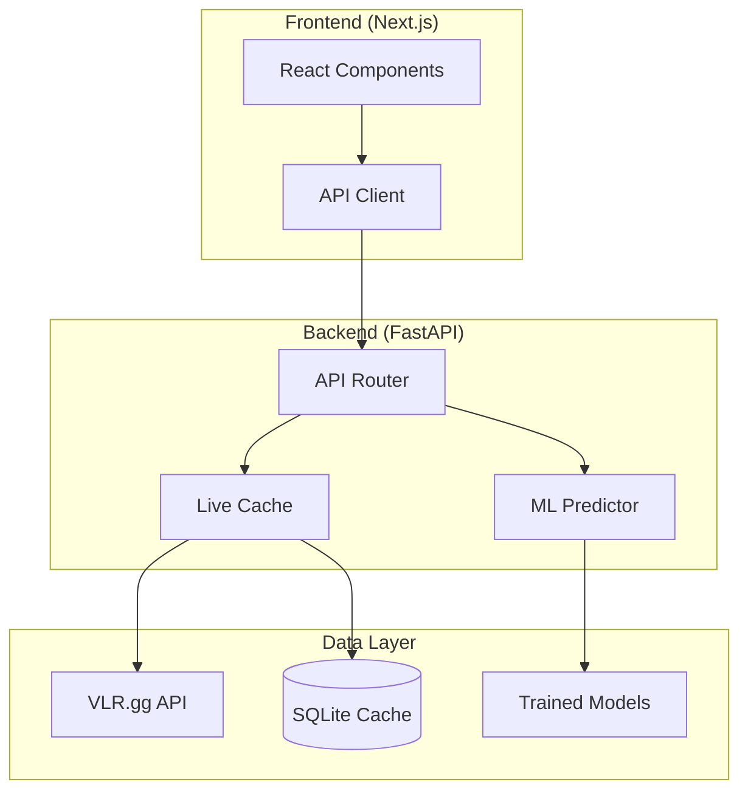

# VLR Predictor

**Machine Learning System for Valorant Esports Match Predictions**

[](https://github.com/YOUR_USERNAME/vlr-predictor/actions/workflows/ci.yml)
[](https://www.python.org/downloads/)
[](https://nodejs.org/)
[](LICENSE)
[](misc/docs/model_card.md)

A production-ready ML system that predicts Valorant esports match outcomes using real VLR.gg data. Features 55-64% accuracy with zero data leakage, temporal validation, and probability calibration.

---

## Features

- **Map-Level Predictions** - Individual map outcome forecasts with confidence scores
- **Series Simulation** - Best-of-3/5 series probabilities with map permutations
- **Live Data Integration** - Real-time data from VLR.gg API with 365-day lookback
- **Model Explainability** - Transparent feature contributions for each prediction
- **Modern UI** - Responsive Next.js frontend with dark mode

---

## Quick Start

### Docker (Recommended)

```bash
git clone https://github.com/YOUR_USERNAME/vlr-predictor.git
cd vlr-predictor
docker-compose up
```

Access the app at http://localhost:3000

### Manual Setup

```bash
# Clone and setup
git clone https://github.com/YOUR_USERNAME/vlr-predictor.git
cd vlr-predictor

# Backend
cd backend
python -m venv venv
source venv/bin/activate  # Windows: venv\Scripts\activate
pip install -e ".[dev]"
uvicorn app.main:app --reload --port 8000

# Frontend (new terminal)
cd frontend
npm install
npm run dev
```

**URLs:**
- Frontend: http://localhost:3000
- API: http://localhost:8000
- API Docs: http://localhost:8000/docs

---

## Architecture



---

## Tech Stack

| Layer | Technology |
|-------|------------|
| **Frontend** | Next.js 15, React 19, TypeScript, Tailwind CSS, shadcn/ui |
| **Backend** | FastAPI, Python 3.12, scikit-learn, Pydantic |
| **ML** | Logistic Regression, Isotonic Calibration, SHAP |
| **Data** | VLR.gg API, SQLite, Pandas |
| **DevOps** | Docker, GitHub Actions, Vercel, Railway |

---

## Model Performance

| Metric | Value |
|--------|-------|
| Accuracy | 55-64% |
| Brier Score | 0.24-0.26 |
| Calibration | Isotonic |
| Data Leakage | Zero |

The model uses 10 historical features (win rates, head-to-head, recent form) with no future information leakage. See the [Model Card](misc/docs/model_card.md) for details.

---

## API Endpoints

| Endpoint | Description |
|----------|-------------|
| `GET /health` | Service health check |
| `GET /advanced/realistic/map-predict` | Single map prediction |
| `GET /advanced/live/map-predict` | Live data prediction |
| `GET /advanced/series-predict` | BO3 series simulation |
| `GET /advanced/available-teams` | List VCT teams |

**Example:**
```bash
curl "http://localhost:8000/advanced/realistic/map-predict?teamA=Sentinels&teamB=Cloud9&map_name=Ascent"
```

See full documentation at http://localhost:8000/docs

---

## Project Structure

```
vlr-predictor/
├── backend/                 # FastAPI backend
│   ├── app/                # Application code
│   │   ├── routers/       # API endpoints
│   │   ├── predictors/    # ML models
│   │   └── schemas/       # Pydantic models
│   ├── artifacts/         # Trained models (.joblib)
│   ├── data/              # Data files
│   └── tests/             # Pytest tests
├── frontend/               # Next.js frontend
│   ├── src/
│   │   ├── app/          # App router pages
│   │   ├── components/   # React components
│   │   └── lib/          # Utilities
│   └── public/           # Static assets
├── misc/                   # Scripts, docs, notebooks
├── docker-compose.yml
└── README.md
```

---

## Development

### Running Tests

```bash
# Backend
cd backend
pytest tests/ -v --cov=app

# Frontend (coming soon)
cd frontend
npm test
```

### Code Quality

```bash
# Backend linting
cd backend
ruff check app/
black app/
mypy app/
```

---

## Deployment

### Vercel (Frontend)
1. Connect your GitHub repo to Vercel
2. Set `NEXT_PUBLIC_API_BASE` environment variable to your Railway URL

### Railway (Backend)
1. Connect your GitHub repo to Railway
2. Set environment variables from `.env.example`
3. Deploy from the `backend/` directory

---

## Contributing

1. Fork the repository
2. Create a feature branch (`git checkout -b feature/amazing-feature`)
3. Commit your changes (`git commit -m 'Add amazing feature'`)
4. Push to the branch (`git push origin feature/amazing-feature`)
5. Open a Pull Request

---

## License

MIT License - see [LICENSE](LICENSE) for details.

---

## Acknowledgments

- [VLR.gg](https://vlr.gg) for esports data
- [vlrggapi](https://vlrggapi.vercel.app) for the API wrapper
- Built with FastAPI, Next.js, and scikit-learn
